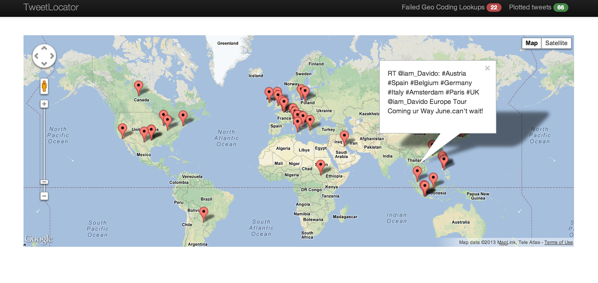

# tweet_locations_ml

## Introduction
In this project we would be working with streaming data in the form of files saved in a directory.Apply K-means clustering algorithm to find where tweets come from i.e (location clusters)
You can also find these in my blog <a href=http://www.prathapkudupublog.com/2019/02/twittter-location-clustering-spark-mllib.html</a>. 

### Installation
<table>
      <tr>
            <code>git clone https://github.com/PRkudupu/tweet_locations_ml.git                                                                  </code>
      </tr>
       
      <tr>
          <code>cd Advanced_sql</code> 
      </tr>
</table>

### License 
tweet_locations_ml is released under the MIT license:
 <a href="https://opensource.org/licenses/MIT">opensource.org/licenses/MIT</a>.
